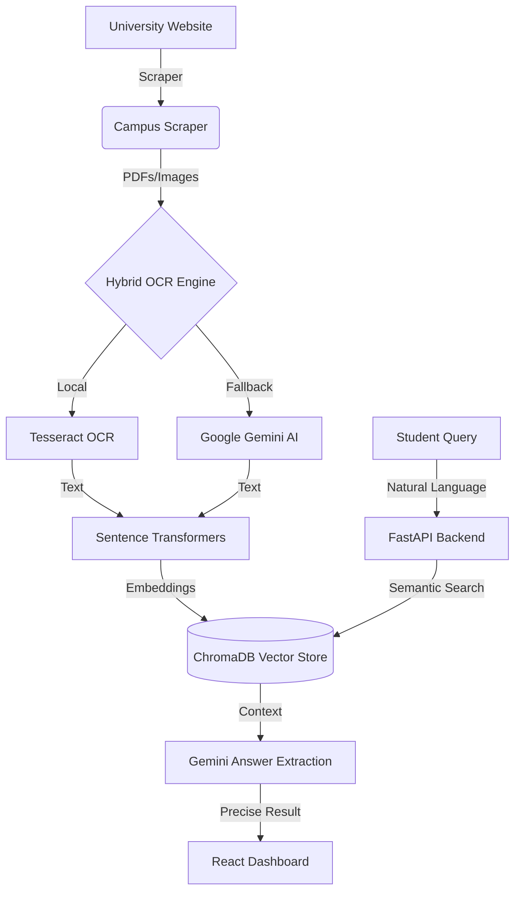

# 🎓 Campus Insight: Digital Archaeology for Universities

[](https://fastapi.tiangolo.com/)
[](https://reactjs.org/)
[](https://ai.google.dev/)
[](https://www.trychroma.com/)

> **Making university documents searchable, one PDF at a time.**

Campus Insight (formerly Digital Archaeology) is a high-performance semantic search and document intelligence engine designed to rescue university announcements from the "dead-end" of scanned PDFs and images. By combining **Hybrid OCR** (Tesseract + Gemini 1.5 Flash) with **Vector Embeddings**, it transforms static notices into a searchable, interactive knowledge base.

---

## ✨ Key Features

- 🔍 **Semantic Search**: Ask natural language questions like *"When is the fee payment deadline?"* instead of hunting through files.
- 🤖 **Hybrid OCR Engine**: Intelligent fallback system that uses local Tesseract OCR for speed and **Google Gemini 1.5 Flash** for high-accuracy complex document parsing.
- 🌐 **Automated Campus Scraper**: Real-time crawling of university notice boards (e.g., GIET) to automatically index new announcements.
- 📊 **Smart Dashboard**: Visual analytics on document categories, system health, and processing latency.
- 💎 **Premium UI**: Glassmorphism-themed React interface with Framer Motion animations and GPU-accelerated performance.

---

## 🏗️ Architecture



---

## 🚀 Getting Started

### 1. Prerequisites
- **Python 3.10+**
- **Node.js 18+**
- **Google Gemini API Key** (for high-accuracy OCR fallback)

### 2. Backend Setup
1. Clone the repository and navigate to the `backend` folder.
2. Install dependencies:
   ```bash
   pip install -r requirements.txt
   ```
3. Create a `.env` file in the `backend/` directory:
   ```env
   GEMINI_API_KEY=your_gemini_api_key_here
   ```
4. Run the server:
   ```bash
   python app.py
   ```
   *The backend will start on `http://localhost:5000`*

### 3. Frontend Setup
1. Navigate to the `frontend` folder.
2. Install dependencies:
   ```bash
   npm install
   ```
3. Create a `.env` file in the `frontend/` directory:
   ```env
   VITE_API_URL=http://localhost:5000
   ```
4. Run the development server:
   ```bash
   npm run dev
   ```

---

## 🛠️ Project Structure

- `backend/`
  - `app.py`: FastAPI server & API endpoints.
  - `ocr_processor.py`: The Hybrid OCR engine logic.
  - `embeddings_search.py`: Vector indexing and semantic retrieval.
  - `campus_scraper.py`: Automated web crawling logic.
  - `chroma_db/`: Local vector storage.
- `frontend/`
  - `src/SearchPage.tsx`: The primary "Campus Insight" dashboard.
  - `src/index.css`: Global glassmorphism styling and animations.

---

## 🧪 Tech Stack

- **Backend**: FastAPI, Uvicorn, Python-Multipart
- **AI/ML**: Google GenAI (Gemini), ChromaDB, Sentence-Transformers, Pytesseract
- **Frontend**: React 19, Vite, Framer Motion, Recharts, Lucide React
- **Scraping**: BeautifulSoup4, Requests

---

## 🏆 Hackathon Context
**Built for GDG - Techsprint 2026**
**Challenge**: PS2: Digital Archaeology

**The Team**:
1. **KAUSHIK MOHANTY**
2. **NILAMANI KUNDU**
3. **DEEPAK KUMAR DAS**

---

## 📄 License
This project is licensed under the MIT License.

---
*Making campus information accessible, transparent, and searchable for every student.* 📚✨
